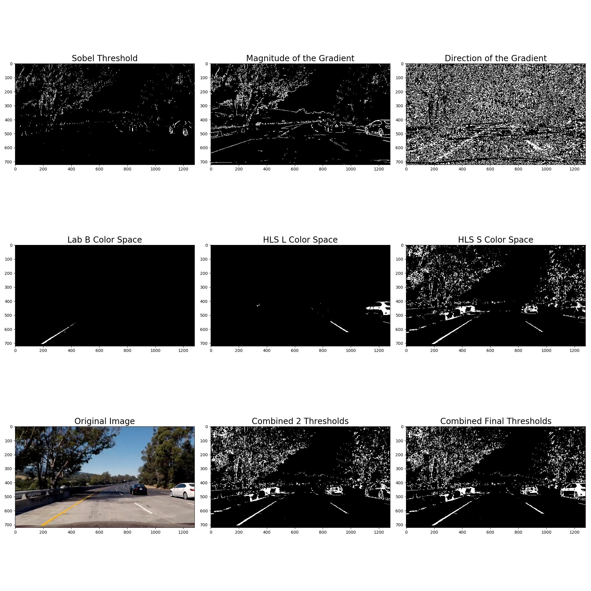

## Advanced Lane Finding
[](http://www.udacity.com/drive)

The Project
---

The goals / steps of this project are the following:

* Compute the camera calibration matrix and distortion coefficients given a set of chessboard images.
* Apply a distortion correction to raw images.
* Use color transforms, gradients, etc., to create a thresholded binary image.
* Apply a perspective transform to rectify binary image ("birds-eye view").
* Detect lane pixels and fit to find the lane boundary.
* Determine the curvature of the lane and vehicle position with respect to center.
* Warp the detected lane boundaries back onto the original image.
* Output visual display of the lane boundaries and numerical estimation of lane curvature and vehicle position.


## [Rubic Points](https://review.udacity.com/#!/rubrics/476/view)
### Camera Calibration
Have the camera matrix and distortion coefficients been computed correctly and checked on the calibration test image?

The code for this step is contained in the first code cell of the Python library located in `/lib/camera_calibration.py`.
To calibrate camera I started with objpoints, imgpoints. Prepared object points, like (0,0,0), (1,0,0), (2,0,0) ....,(6,5,0). I used 9x6 chess board from `camera_cal`. For each image in camera_cal folder I use OpenCv function to convert image to grey colo cheme `cv2.cvtColor(image, cv2.COLOR_BGR2GRAY)`. To find chess board corners on each image I used `ret, corners = cv2.findChessboardCorners(gray, (9,6), None)`. If `ret` was `True` conrners were found and I added them to the array of `imgpoints`. Than I draw chess board conrners on the output image with `cv2.drawChessboardCorners(image, (nx,ny), corners, ret)`. After calibrating camera with the steps discribed above I received `mtx` and `dist` values by running `mtx, dist = calibrate_camera()`. For example output images I used calibration camera results to run it on the set of images to show that it works, I used `dst = cv2.undistort(img, mtx, dist, None, mtx)`. Here is what I got:


More image examples in `/output_images/pre_process_steps/` folder.
### Pipeline (single images)
For each of the images in `test_images` I created a pipaline. The frist step was to get saved calibration camera results from `output_images/calibrate_camera.p` 
```python
with open("output_images/calibrate_camera.p", "rb") as f:
        save_dict = pickle.load(f)
    mtx = save_dict["mtx"]
    dist = save_dict["dist"]
```
and apply it to the images to undistored each images with OpenCv function `undist = cv2.undistort(img_in, mtx, dist, None, mtx)`.
Here is an example 

Step two was to take undistoredted image and apply combined threshold with `img, combined2, abs_bin, mag_bin, dir_bin, hls_s_bin, lab_b_bin, hls_l_bin = combined_thresh(undist)`
Here is an axample 

As a finale image pre processgin step I did perspective transform with `binary_warped, binary_unwarped, m, m_inv = perspective_transform(img)`, `img` is the output of thepreviouse function `combined_thresh()`.

Here is an aexample 

Next step was to draw a sliding box on found lane line to locate just the lane line and exclude the rest of the pixels that do not belond to the lane.

`line_fit(binary_warped)` will try to find a line on the image. 

Try to fit left and right lines with
```python
    left_fit = left_line.add_fit(left_fit)
    right_fit = right_line.add_fit(right_fit)
```

Calculate line curvature `left_curve, right_curve = calculate_curve(left_lane_inds, right_lane_inds, nonzerox, nonzeroy)`.
I used these formulars to calculate it: 


As a final step try to find vechicle offset `vehicle_offset = calculate_vehicle_offset(undist, left_fit, right_fit)`

### Pipeline (video)
The image processing pipeline that was established to find the lane lines in images successfully processes the project video. The pipeline correctly maps out curved lines and does not fail when shadows or pavement color changes are present.

In the first few frames of video, the algorithm performs a search without prior assumptions about where the lines are. Once a confidence detection is achieved, that positional knowledge is used in future iterations as a starting point to find the lines.

[Project video](/output_images/video/project_video_output.mp4)
[Challenge video](/output_images/video/challenge_video_output.mp4)
[Harder Challenge video](/output_images/video/harder_challenge_video_output.mp4)

### Discussion
*  This problem involves lot of hyper-parameters that need to be tuned invididually and properly to get the correct outcome. Perhaps, use of tools like the varying hyperparameters to check the output could be beneficial.
*  During video testing, I used `subclip = VideoFileClip("project_video.mp4").subclip(41, 43)` a `subclip` to see/render only a part of the video, because rendering of the full video is very CPU heavy and time consuming.
*  The pipeline fails in low light conditions where the lanes are not visible, covered with dark shades or lane curves spontaneously and drastically. This was observed during the testing of the pipeline on Challege and Hard challege videos.
This project was based on computer vision techniques, to enhence line detection and perhaps improve algorythm performance, I would like to implement a solution to this problem using machine learning technics I acquired during previouse lessons.